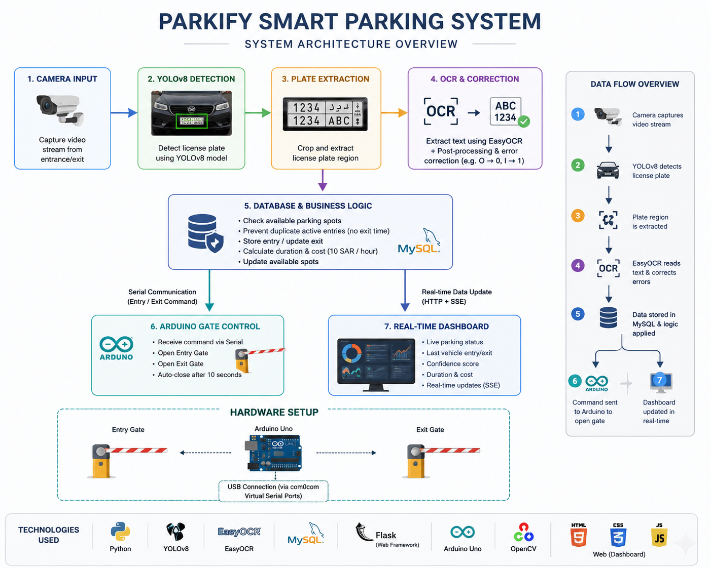
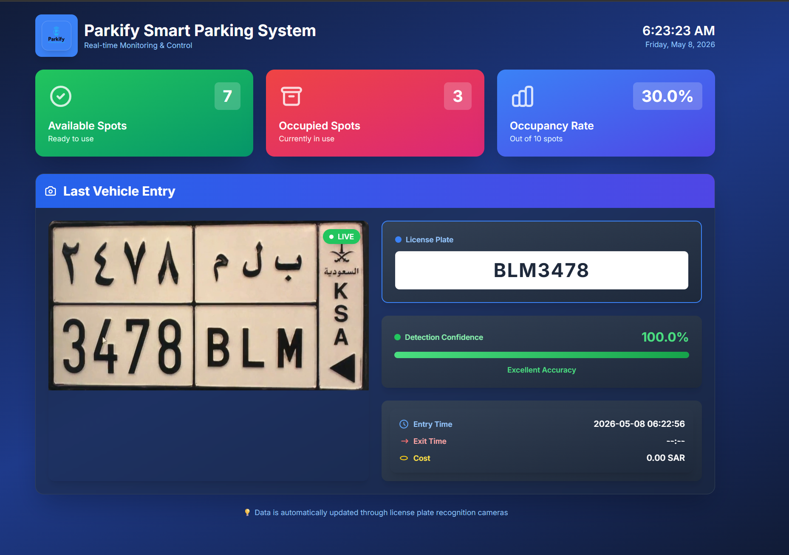
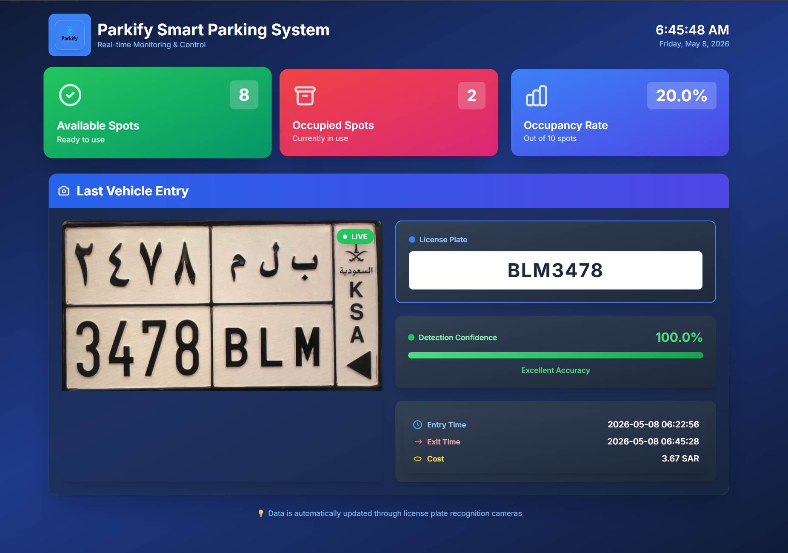
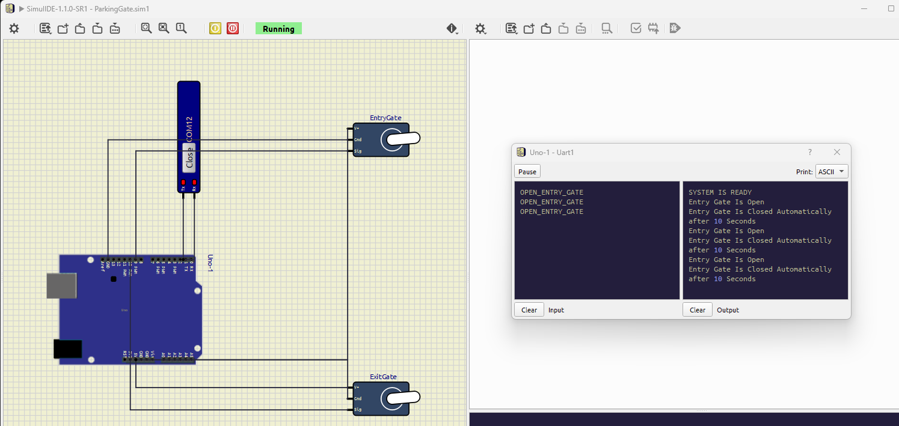
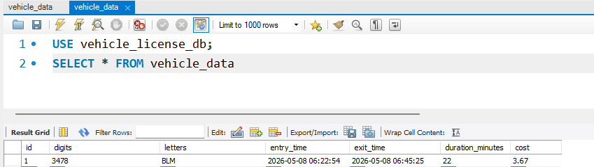

# Parkify Smart Parking System

> AI-powered smart parking system using YOLOv8, EasyOCR, Flask, MySQL, and Arduino automation.

---

# Overview

Parkify is an AI-powered smart parking management system designed to automate vehicle entry and exit processes using real-time license plate recognition.

The system detects Saudi license plates using a custom-trained YOLOv8 model, extracts vehicle information through EasyOCR, stores parking records in a MySQL database, automatically calculates parking costs, and controls parking gates using Arduino automation.

The project was developed as a graduation project and received the highest grade (A).

---

# Key Features

* Real-time vehicle license plate detection
* Custom-trained YOLOv8 model for Saudi license plates
* OCR-based character recognition using EasyOCR
* Automatic parking entry and exit management
* Real-time dashboard updates without page refresh
* Automatic parking cost calculation
* Gate automation using Arduino Uno and Servo Motors
* Prevent duplicate vehicle entries without exit records
* Parking availability verification before allowing entry
* Paper-free parking experience
* Hardware simulation using SimulIDE and virtual serial communication

---

# System Architecture

The system consists of multiple integrated modules working together in real time:

1. Camera module captures incoming vehicles
2. YOLOv8 detects and crops the license plate
3. EasyOCR extracts letters and numbers from the plate
4. Database module validates and stores vehicle data
5. Dashboard updates parking information in real time
6. Arduino module opens entry or exit gates automatically

---

# Technologies Used

## Artificial Intelligence & Computer Vision

* YOLOv8
* EasyOCR
* OpenCV
* CVAT Annotation Tool

## Backend

* Python
* Flask
* MySQL

## Frontend

* HTML
* CSS
* JavaScript

## Hardware & Simulation

* Arduino Uno
* Servo Motors
* SimulIDE
* Serial Communication
* com0com Virtual Ports

---

# Dataset & Model Training

The YOLOv8 model was custom-trained using a dataset of Saudi license plates.

* More than 500 Saudi license plate images were used
* Annotation was performed manually using CVAT
* Three custom classes were created:

  * License_Plate
  * Latin_Numbers
  * Latin_Letters

The separation between letters and numbers significantly improved OCR accuracy and reduced recognition mistakes between similar characters such as:

* O and 0
* I and 1

Additional correction functions were implemented:

* correct_ocr_digits_errors()
* correct_ocr_letters_errors()

---

# Real-Time Dashboard

The dashboard provides live parking monitoring and vehicle tracking.

It displays:

* Available parking spots
* Occupied parking spots
* Occupancy rate
* Vehicle license plate
* Detection confidence
* Entry time
* Exit time
* Parking cost

The dashboard updates automatically in real time using Server-Sent Events (SSE) without requiring page refresh.

---

# Hardware Integration

The system integrates with Arduino Uno to automate parking gate operations.

When a vehicle is verified:

* The Python backend sends serial commands
* Arduino receives the command through virtual COM ports
* Servo motors automatically open the gate
* Gates close automatically after a few seconds

SimulIDE was used to simulate the hardware environment.

---

# Parking Cost Calculation

The system automatically calculates parking cost based on parking duration.

Current pricing:

* 10 SAR per hour

The pricing logic can be modified directly from:

```python
SQLDatabase.py
```

---

# Screenshots

## System Architecture



---

## Real-Time Dashboard



---

## Exit & Cost Calculation



---

## Arduino Gate Simulation



---

## Database Records



---

# Demo Video

Watch the project demo video here:

[Demo Video](https://drive.google.com/file/d/1Z5Up0w0phJSewkA-rRE39r32oegX5lbp/view?usp=sharing)

---

# Project Structure

```bash
Parkify-Smart-Parking-System/
│
├── ai/
│   ├── EasyOCR.py
│   ├── UsingCamera.py
│   ├── MyTraining.py
│   ├── PassImageToEasyOCR.py
│   └── config.yaml
│
├── arduino/
│   ├── arduino.py
│   └── ParkifyGateCode.ino
│
├── dashboard/
│   ├── dashboard.py
│   ├── templates/
│   └── static/
│
├── database/
│   └── SQLDatabase.py
│
├── docs/
│   ├── architecture-diagram.png
│   ├── parkify-architecture-overview.png
│
├── screenshots/
│   ├── dashboard-entry.png
│   ├── dashboard-exit.png
│   ├── arduino-simulation.png
│   └── database-records.png
│
├── .gitignore
└── README.md
```

---

# Installation

## 1. Clone the repository

```bash
git clone https://github.com/Galal-Alzumaili/Parkify-Smart-Parking-System.git
```

## 2. Install dependencies

```bash
pip install -r requirements.txt
```

## 3. Configure MySQL database

Create a MySQL database and update the database credentials inside:

```python
SQLDatabase.py
```

## 4. Add trained YOLO model

Place your trained YOLOv8 model inside:

```bash
runs/detect/train8/weights/
```

## 5. Run the dashboard

```bash
python dashboard.py
```

## 6. Run camera detection

```bash
python UsingCamera.py
```

---

# Challenges Faced

## OCR Accuracy Issues

One of the main challenges was OCR confusion between similar characters such as:

* O and 0
* I and 1

This problem was solved by:

* Separating letters and numbers into different classes
* Training a custom YOLO model
* Implementing correction functions for OCR outputs

---

## Hardware Communication

Another challenge was establishing communication between Python and Arduino.

This was solved using:

* Serial communication
* com0com virtual ports
* SimulIDE hardware simulation

---

# Current Limitations

* Requires a trained YOLO model for accurate detection
* Requires Arduino setup and serial communication configuration
* Difficult to recognize unclear or damaged license plates
* Vehicles without visible license plates cannot be processed

---

# Future Improvements

* Mobile application integration
* Cloud database support
* Online dashboard deployment
* Automatic payment integration
* Parking reservation system
* Multi-camera support
* Vehicle analytics and reporting

---

# Graduation Project

This project was developed as a graduation project in Computer Science and received the highest grade (A).

---

# Author

Galal Alzumaili

Computer Science Graduate

www.linkedin.com/in/galal-alzumaili

---

# License

This project is intended for educational and portfolio purposes.
